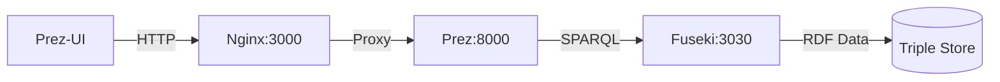

# Prez Demo

A repository that can be used to quickly stand up and demo the full
[Prez](https://github.com/rdflib/prez) stack locally.

## Prerequisites

- [task](https://taskfile.dev/installation/) - Task runner
- [docker](https://docs.docker.com/engine/install/) - Container runtime
- [pnpm](https://pnpm.io/installation) - Fast Node.js package manager
- [node](https://nodejs.org/en) - JavaScript runtime
- [uv](https://docs.astral.sh/uv/getting-started/installation/) - Python package
  management

## Usage

To start the demo, run

```bash
task demo:start
```

This will:

1. Install and build the Prez-UI frontend
2. Start the Docker containers (Fuseki, Prez, Nginx)
3. Load sample RDF data into Fuseki
4. Open the Prez-UI in your default browser at http://localhost:3000/catalogs

To stop the demo, run

```bash
task demo:stop
```

## Services and Ports

- **Prez-UI**: http://localhost:3000 - Web interface
- **Prez API**: http://localhost:8000 - Backend service
- **Fuseki**: http://localhost:3030 - SPARQL endpoint

## Data

Sample RDF data is loaded from the `./data` directory into the Fuseki triple store. The
data includes demonstration catalogs and datasets that showcase Prez's capabilities.

## Customization

You can customize the demo by:

- Modifying the data in the `./data` directory
- Adjusting versions in `Taskfile.yml`

## Overview

The Prez Demo stands up three main services:



- **Prez-UI**: Modern web interface for browsing RDF data (React-based frontend)
- **Prez**: Python backend service that provides APIs and transforms RDF data
- **Fuseki**: RDF database providing SPARQL endpoint and triple storage
- **Nginx**: Web server serving the static Prez-UI files and proxying API requests

## Related Projects

This demo integrates several key projects:

- **[rdflib/prez](https://github.com/rdflib/prez)**: The core Prez backend service
- **[rdflib/prez-ui](https://github.com/rdflib/prez-ui)**: The modern web interface for
  Prez
- **[kurrawong/fuseki](https://github.com/kurrawong/fuseki)**: Dockerized Fuseki RDF
  database

## FAQ

<details>
<summary>Does Prez run on windows?</summary>

Yes, although no effort has been made by the prezdemo repository to ensure that this
demo will run on Windows machines.

If that is something you are interested in, let us know or PRs welcome.

</details>

<details>
<summary>How can I serve this demo over the web?</summary>
You can do this, but you will need to tell Prez-UI where it is being served from.

> By default Prez-UI (which runs in the browser) expects to find Prez at
> http://localhost:8000

If you are running the demo on a VM at <http://prez.demo>

Then you would run:

```bash
task install:prez-ui
echo "NUXT_PUBLIC_PREZ_API_ENDPOINT=http://prez.demo:8000" > prez-ui/.env
task demo:start
```

You could then access the demo at <http://prez.demo:3000>

> Naturally you will want to make sure that all the ports are exposed to the
> public internet
>
> - port 3000 (prez-ui)
> - port 8000 (prez-api)
> - port 3030 (fuseki)
>
> If you would rather not use port 3000 for Prez-UI then update the
> [compose.yml](./docker/compose.yml) file accordingly.

</details>
